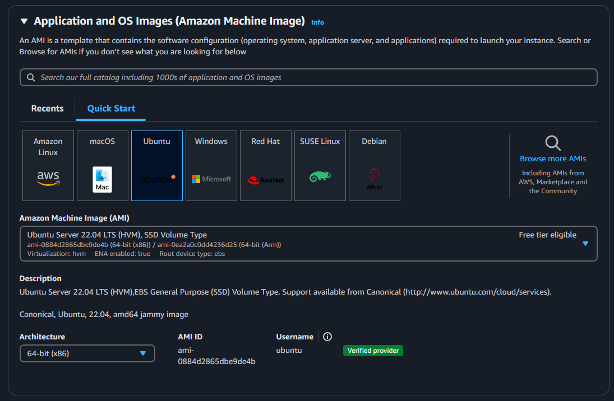

# Guia para Criar uma Instância EC2 da API

Este guia descreve os passos necessários para criar e configurar uma instância EC2 na AWS, incluindo a configuração de uma VPC e um Security Group.

---

## 1. Criando a VPC

Antes de criar a instância EC2, é necessário configurar uma **VPC**.

1. No **Console Home** da AWS, clique em **View all Services** e selecione a opção **VPC**.
2. Clique no botão **Create VPC**, como mostrado na imagem abaixo:

   

3. Na próxima tela:
   - Selecione a opção **VPC and more**.
   - Dê um nome para a tag.
   - Role a tela para baixo e clique em **Create VPC**.

   

---

## 2. Criando um Security Group

Após criar a VPC, siga os passos para configurar um **Security Group**:

1. No **Console Home**, clique em **EC2** e depois em **Security Groups**:

   

2. Preencha as informações necessárias:
   - **Nome:** Insira um nome para o Security Group.
   - **Descrição:** Adicione uma breve descrição.
   - **VPC:** Selecione a VPC criada anteriormente.

   

3. Adicione as **Inbound Rules** (Regras de Entrada):
   - Clique em **Add rule** e configure as regras como na imagem abaixo:

     

     - **27017 (Custom TCP):** Permite conexão ao MongoDB.
     - **3000 (Custom TCP):** Permite conexão com a API.
     - **8080 (Custom TCP):** Permite acesso geral à internet.
     - **22 (SSH):** Permite conexão SSH à instância EC2.

4. Deixe as **Outbound Rules** (Regras de Saída) com a configuração padrão:

   

5. Clique em **Create Security Group** para finalizar.

---

## 3. Criando a Instância EC2 da API

1. No **Console Home**, clique em **EC2** e depois em **Launch Instance**:

   

2. Configure as seguintes opções:

### Parte 1: Tags
- Crie 3 tags, como mostrado na imagem, clicando em **Add new tag**:

  

  Certifique-se de usar exatamente os mesmos nomes e selecionar **Instances** e **Volumes** em **Resource Types**.

### Parte 2: Sistema Operacional (SO)
- Escolha **Ubuntu Server 22.04 LTS (HVM), SSD Volume Type**:

  

### Parte 3: Key Pair
- Clique em **Create new key pair**:

  

- Preencha as informações na tela seguinte:
  - **Nome:** Insira um nome para a chave.
  - **Key pair type:** Selecione **RSA**.
  - **Private key file format:** Escolha **.pem**.
  - Clique em **Create key pair** e salve o arquivo gerado.

  

### Parte 4: Configuração de Rede
- Clique em **Edit** e configure:
  - **VPC:** Selecione a VPC criada.
  - **Auto-assign public IP:** Habilite como **Enable**.
  - **Firewall (Security Group):** Selecione **Select existing security group** e escolha o Security Group configurado anteriormente:

  

### Parte 5: Armazenamento
- Escolha a quantidade de armazenamento. Neste projeto, foi utilizado **16 GB gp2**:

  

3. Clique em **Launch Instance** para finalizar:

   

---

## 4. Conectando à Instância EC2

1. No painel **EC2**, clique em **Instances (running)**, selecione a instância criada e clique em **Connect**.
2. Siga as instruções para usar o comando SSH, que terá o seguinte formato:

   ```sh
   ssh -i "NomeDaChave.pem" ubuntu@ec2"IP-público".us-east-2.compute.amazonaws.com
   ```

3. Cole o comando no terminal WSL para acessar a instância.

---

## 5. Copiando a API para a Instância

Para transferir os arquivos da API para a instância EC2, use o comando **scp** no terminal WSL:

```sh
scp -i ~/MinhaChaveDaApi.pem -r ~/stackovershop-api ubuntu@ec2"IP-público".us-east-2.compute.amazonaws.com:~/
```

---

## 6. Próximos Passos

A instância EC2 está configurada e a API foi transferida. Siga o guia de **Deploy da API** para finalizar a configuração. Agora a instância está online e pronta para uso!
