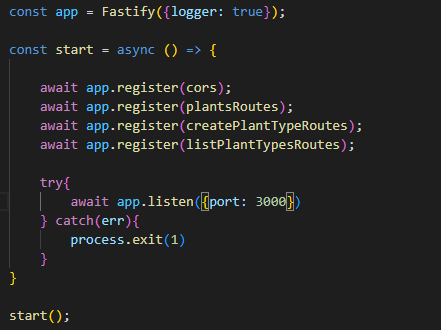
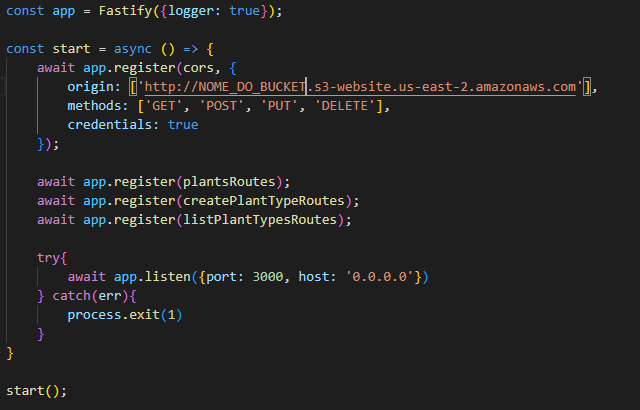
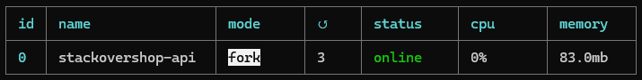

# Deploy do Backend

Este guia descreve o processo de **deploy do backend** da aplicação, hospedando-o em uma instância **EC2** da AWS e garantindo a comunicação correta com o **MongoDB**, que está rodando em outra instância **EC2**.

A criação das instâncias já foi descrita em outro arquivo. Foram criadas duas instâncias: uma para a **API** e outra para o **Banco de Dados**.

---

## 📌 1. Configuração, Atualização e Instalação de Aplicativos na Instância

Após a criação da instância para a API, conecte-se a ela via terminal WSL com o seguinte comando:

```sh
ssh -i "SuaChave.pem" ubuntu@ec2-"IP público da API".us-east-2.compute.amazonaws.com
```

Após acessar a instância, execute o seguinte comando para atualizar todos os pacotes do sistema operacional:

```sh
sudo apt update && sudo apt upgrade -y
```

Após a atualização, instale alguns utilitários básicos (alguns já podem estar instalados, mas o comando garante que estejam presentes):

```sh
sudo apt install -y curl gnupg nano wget unzip
```

### 🔹 Instalando o Node.js e o PM2

Será instalada a versão **Node.js 18**, pois versões muito recentes podem causar incompatibilidade com dependências como **Prisma** e **Fastify**. Execute:

```sh
curl -fsSL https://deb.nodesource.com/setup_18.x | sudo -E bash -
sudo apt install -y nodejs
```

Agora, instale o **PM2**, que gerencia processos e manterá a API rodando:

```sh
sudo npm install -g pm2
```

---

## 📌 2. Configuração da API

Após as instalações, algumas configurações precisam ser feitas.

### 🔹 Acessando o Diretório da API

Se a API já foi transferida para a instância EC2, navegue até o diretório com:

```sh
cd stackovershop-api
```

Caso contrário, também seria possível clonar o repositório remoto com:

```sh
git clone <URL_DO_REPOSITORIO>
cd stackovershop-api
```

### 🔹 Criando o Arquivo `.env`

Crie o arquivo de variáveis de ambiente:

```sh
nano .env
```

Adicione as seguintes linhas:

```env
PORT=3000
MONGO_URI="mongodb://"IP público da instância do BD":27017/StackOverShop?replicaSet=rs0"
```

A primeira linha define a **porta da API**, e a segunda especifica onde a API irá se conectar ao banco de dados.

Após adicionar essas linhas, **salve e saia do editor Nano**.

### 🔹 Instalando Dependências e Configurando o Prisma

Instale as dependências do projeto:

```sh
npm install
```

Gere os arquivos necessários para conexão com o banco de dados:

```sh
npx prisma generate
```

### 🔹 Alterando o Arquivo `server.ts`

Entre na pasta `src` e edite o arquivo `server.ts`:

```sh
cd src
nano server.ts
```

O código original precisa ser alterado conforme indicado:

**Antes:**



**Depois:**



As alterações incluem a **configuração do CORS**, permitindo que o frontend hospedado no S3 acesse a API na EC2 sem bloqueios. Além disso, a API precisa ser acessível externamente, então a opção `host: '0.0.0.0'` foi adicionada ao `listen`.

### 🔹 Ajustando o `tsconfig.json`

Volte para a pasta raiz do projeto e edite o arquivo `tsconfig.json`:

```sh
cd ..
nano tsconfig.json
```

Altere as seguintes linhas:

```json
"rootDir": "./src",
"outDir": "./dist",
```

No final do arquivo, antes da última chave, adicione:

```json
"include": ["src/**/*.ts"],
"exclude": ["node_modules"]
```

⚠ **Cuidado para não esquecer as vírgulas nos lugares corretos!**

### 🔹 Alterando o `package.json`

Edite o arquivo `package.json` para adicionar o script de build:

```sh
nano package.json
```

No bloco `"scripts"`, adicione:

```json
"build": "tsc"
```

Não esqueça da vírgula na linha anterior, se necessário.

---

## 📌 3. Build e Execução da API

Após as configurações, faça o **build** do projeto:

```sh
npm run build
```

Isso criará a pasta `/dist`. Agora, inicie a API com **PM2**:

```sh
pm2 start dist/server.js --name stackovershop-api
```

⚠ **O parâmetro `--name` pode ser qualquer nome, mas foi mantido como `stackovershop-api` para organização.**

Após a execução, o terminal exibirá:



### 🔹 Configurando a Inicialização Automática

Para garantir que a API inicie automaticamente sempre que a instância for reiniciada, execute:

```sh
pm2 startup
pm2 save
```

Se houver problemas com o **firewall**, libere a porta 3000 com:

```sh
sudo ufw allow 3000/tcp
```

---

## 📌 4. Finalização

✅ **Agora a API está rodando na EC2, conectada ao frontend e ao banco de dados!** 🎉

---

Se precisar atualizar o backend no futuro:

1. **Acesse a instância** via SSH.
2. **Entre na pasta da API**:
   ```sh
   cd stackovershop-api
   ```
3. **Atualize o código**:
   ```sh
   git pull origin main
   ```
4. **Recompile e reinicie a API**:
   ```sh
   npm run build
   pm2 restart stackovershop-api
   ```

Agora sua API está **pronta para produção**! 🚀