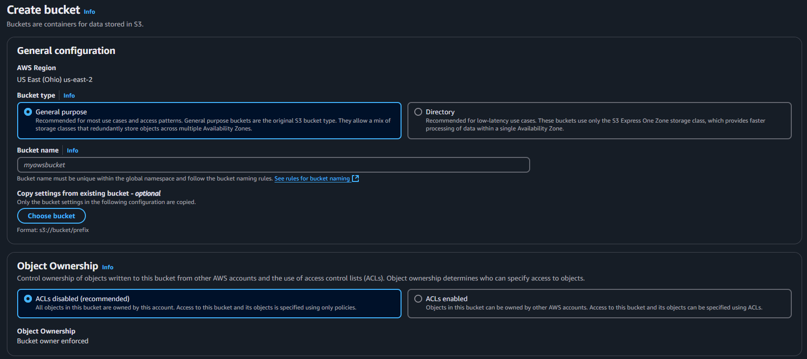
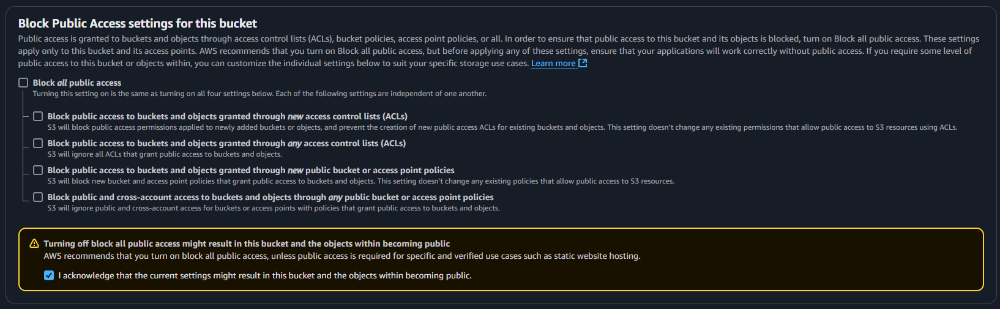
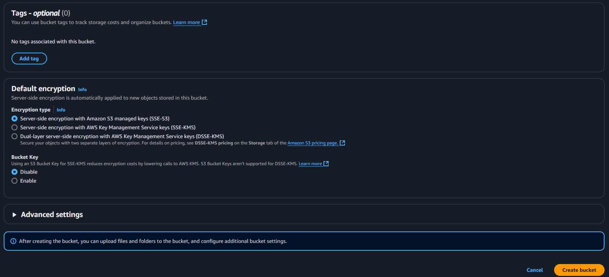
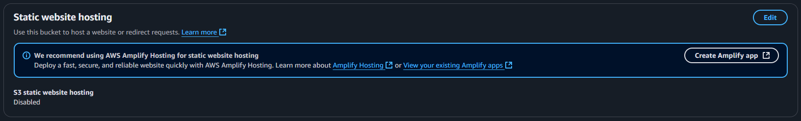
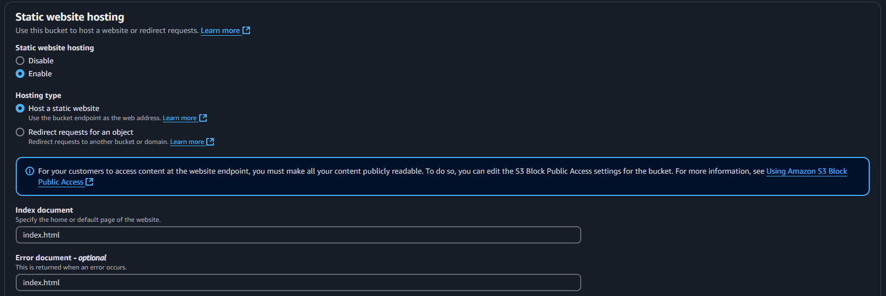
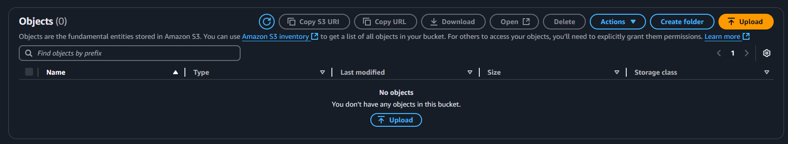
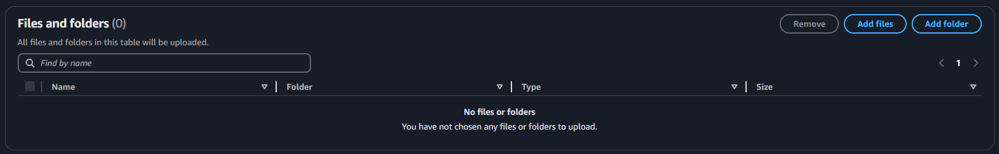

# Deploy do Frontend

Este guia descreve o processo de **deploy do frontend** da aplicação, hospedando-o na AWS **S3** e garantindo a comunicação correta com a API na instância **EC2**.

---

## 📌 1. Criando e Configurando o Bucket na S3

Antes de realizar o deploy, é necessário criar um **Bucket na S3**.

### 🔹 Criando o Bucket

1. No **Console Home** da AWS, clique no link **S3**.
2. Na página seguinte, clique no botão **Create bucket**.
3. Aparecerá a seguinte tela:

   

4. Em **General Configuration**:
   - Selecione **General Purpose** para **Bucket Type**.
   - Defina um nome para seu bucket em **Bucket Name**.
   - Em **Object Ownership**, deixe a opção **default**.

5. Role a tela até **Configuração de Acesso Público** e desmarque a opção **Block all public access**, conforme a imagem abaixo:

   

6. Marque a opção **Turning off all public access...**.
7. Deixe as demais configurações como **default**.
8. Role a tela até o final e clique em **Create bucket**:

   

---

### 🔹 Configurando o Static Website Hosting

1. Após criar o bucket, ele aparecerá em uma lista. Clique nele.
2. Na tela seguinte, clique na aba **Properties** e role até o final.
3. Localize a opção **Static website hosting** e clique em **Edit**:

   

4. Ative a opção **Enable** para habilitar o hosting no bucket. A tela mudará para:

   

5. Em **Index Document**, escreva `index.html`.
6. Em **Error Document**, escreva também `index.html`.
7. Clique em **Save Changes**.

✅ O bucket está configurado e pronto para receber os arquivos do frontend!

---

## 📌 2. Fazendo o Deploy do Frontend

### 🔹 Atualizando as Referências da API

1. No código do frontend, altere todas as referências de:
   ```js
   http://localhost:3000
   ```
   para:
   ```js
   http://"IP público da instância":3000
   ```
   *(Substitua `"IP público da instância"` pelo IP real da API hospedada na EC2.)*

### 🔹 Criando o Build do Frontend

1. No terminal, navegue até a pasta do frontend e execute:
   ```bash
   npm run build
   ```
2. Esse comando gerará uma pasta chamada **/dist** contendo os arquivos otimizados para produção.

### 🔹 Fazendo Upload dos Arquivos para o S3

1. No **Console Home** da AWS, acesse **S3** e clique no nome do bucket criado.
2. Dentro do bucket, clique no botão **Upload**:

   

3. Clique em **Add files** e **Add folder** para selecionar os arquivos da pasta `/dist`:

   

4. Selecione **todos os arquivos** dentro de `/dist` primeiro, depois selecione a **pasta existente**.
5. Clique no botão **Upload** e aguarde a conclusão.

✅ O frontend está hospedado no bucket!

---

## 📌 3. Acessando a Aplicação

1. Volte ao bucket no **Console S3**.
2. Clique na aba **Properties** e role até o final.
3. Em **Static website hosting**, copie o **link da aplicação**:

   

4. Cole o link no navegador.
5. A aplicação estará **funcionando com a API e o banco de dados integrados**! 🎉

---

## 🛠️ Conclusão

Agora seu frontend está **online** e **conectado** à API hospedada na EC2. Para futuras atualizações, basta repetir o processo de build (`npm run build`) e fazer o **upload** dos novos arquivos no bucket S3. 🚀
